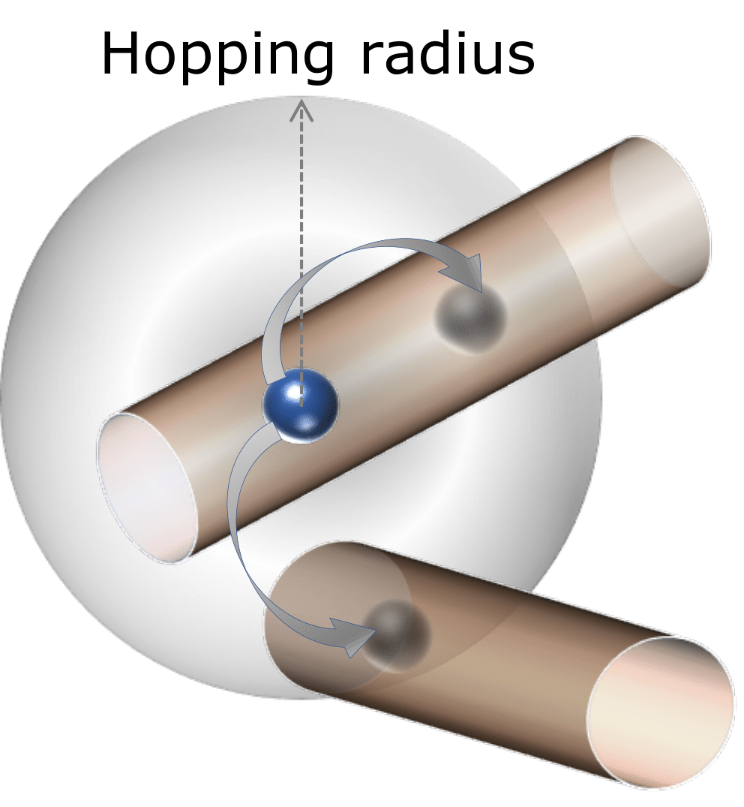

DECaNT
=========================================
### Project Contributers
Y. C. Li, A. H. Davoody, S.W. Belling, A. J. Gabourie, and I. Knezevic

Official implementation of [DECaNT: Simulation Tool for Diffusion of Excitons in Carbon Nanotube Films](https://arxiv.org/pdf/1703.05192.pdf). The work is based on project from former group member AmirHossein Davoody and Alexander J Gabourie. Initial commitment can be find here: [Mesh](https://github.com/amirhosseindavoody/carbon_nanotube_mesh), [Monte Carlo](https://github.com/amirhosseindavoody/cnt_film_monte_carlo).

Dependancy
-------------
This project is only support on linux or linux-like operating system. Some basic external library dependencies are follow:
   - Python 3
   - Armadillo
   - BulletPhysics
### Armadillo
Armadillo is a linear algebra library. Before installing armadillo, we need to make sure BLAS and LAPACK is installed. Installation:

    $ sudo apt install libopenblas-dev liblapack-dev

Then we are ready for installing Armadillo. There are two ways to approach: either go to [website](http://arma.sourceforge.net/download.html) to obtain tar ball or directly using package management:

    $ sudo apt-get install libarmadillo-dev
    
### BulletPhysics
BulletPhysics is open-source real-time physics simulation library. We use this library to simulate carbon nanotube mesh with different morphologies. Installation will need OpenGL library to vender the scene. Detailed instruction could refer to [old repo](https://github.com/amirhosseindavoody/carbon_nanotube_mesh/wiki)
   
Mesh Generation
----------------
### Code Structure
The code structure is simple. There is only one class called cnt_mesh which will contain all the details about carbon nanotube: total length, segment length, tube chirality in arrays. Functions defined in this class will transfer desired carbon nanotube to rigid body and drop it at certain height. Main.cpp will act as a upper-level structure to set up and run BulletPhysics scene and also call functions in cnt_mesh to generate new tubes. The output file will recode the position, orientation and chirality of every segment of the tubes. More detailed explanation can be found [Here](https://github.com/amirhosseindavoody/carbon_nanotube_mesh).

After generating tubes, we need to post-process the output files with a python script. The python script is used to interpolate limited position data of each segment into a smooth curve which will represent actual curvy nanotube in real world. After that, the script will sample position points along each tube to be the position of scattering sites in monte carlo simulation.

### Run example
First, direct inside folder and use Makefile to build the project.

    $ cd mesh
    $ make main
    
Then run the main.exe after setting up input.json

    $ main.exe input.json

Run the python script.

    $ cd python_script
    $ python3 create_fine_mesh.py
    

Monte Carlo Simulation
----------------
### Code Structure
Main Code is in monte_carlo folder. The whole simulation is divided into three major object: Simulation itself, exciton and scattering sites. Each object has its class with detailed attributions and methods. Simulation object is the top-layer client that will create exciton and scattering sites based on simulation metrics. The output file contains displacement and position of excitons at each time step.

There are complementary code in exciton transfer and helper folder. In exciton transfer folder, codes are used in calculating Carbon Nanotube bandstructure and resonant exciton transfering. Functions will be called by Monte Carlo Simulation code to generate scattering table.

### Run example
First, direct inside folder and use Makefile to build the project.

    $ cd montecarlo
    $ make main
    
Then run the main.exe after setting up input.json

    $ main.exe input.json

